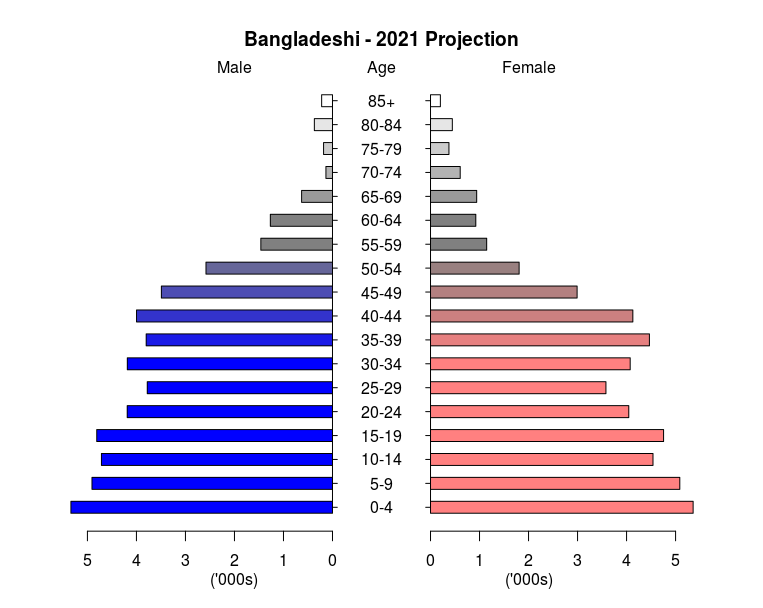
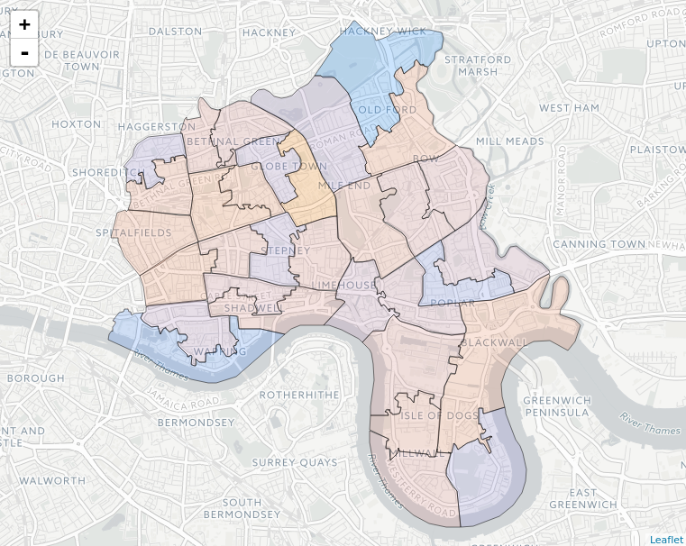

# Microsimulation for Demography - Worked Examples

## Prerequisites

The code is written in R. We recommend the use of the most recent version of RStudio and users will need sufficient admin priviledges to install packages. The code is dependent on a number of standard (CRAN) packages, such as data.table, sf, leaflet, plotrix, devtools, Rcpp

The code is also dependent on the humanleague package which is currently only available on github. Both can be installed using the following commands:
```
> devtools::install_github("virgesmith/humanleague")
> devtools::install_github("virgesmith/demographyMicrosim")
```
## Common Functionality
* [graph.R](R/graph.R) - graphic visualisations of data derived from the microsyntheses.  
* [map.R](R/map.R) - geographic visualisations of data derived from the microsyntheses.  
* [utils.R](R/utils.R) - helper functions.  


In this example we microsynthesise a base human population for Tower Hamlets from 2011 census data, then microsimulate the evoluation of the population given detailed fertility and mortality data.

## Microsynthesis 

## Microsimulation


### Code
* [microsynthesis.R](R/microsynthesis.R) - takes the input data (population aggregates) and synthesises an individual "base" population.  
* [microsimulation.R](R/microsimulation.R) - takes the microsynthesised data from above, then uses more input data (fertility/mortality rates) to project the population.  

* [graph.R](projection/graph.R) - graphic visualisations of the base and projected populations.  
* [map.R](projection/map.R) - generates statistics from the synthetic population that can be visualised on a map. 

### Input data
The input data consists of two distinct datasets: aggregate population data, and fertility/mortality rate data.

#### Aggregate Population Data
Population aggregate data is sourced from UK census 2011, for the London Borough of Tower Hamlets at middle-layer super output area (MSOA) resolution. MSOA corresponds to a subregion containing approximately 8,000 people. Tower Hamlets is split into 32 MSOAs and its total population is recorded as just over 250,000.

For the purposes of this worked example we have preprocessed the census data into the following csv files:

* [sexAgeEth.csv](projection/data/sexAgeEth.csv) - count of persons by MSOA by sex by age band by ethnicity
* [sexAgeYear.csv](projection/data/sexAgeYear.csv) - count of persons by MSOA by sex by age band by ethnicity

Categories
* MSOA: ONS code for the 32 MSOAs within Tower Hamlets
* Sex: M/F
* Age Band: 0-4, 5-7, 8-9, 10-14, 15, 16-17, 18-19, 20-24, 25-29, 30-34, 35-39, 40-44, 45-49, 50-54, 55-59, 60-64, 65-69, 70-74, 75-79, 80-84, 85+
* Age: individual years up to 84, then a single 85+
* Ethnicity: BAN (Bangladeshi), BLA (Black African), BLC (Black Caribbean), CHI (Chinese), IND (Indian), MIX (Mixed), OAS (Other Asian), OBL (Other Black), OTH (Other), PAK (Pakistani), WBI (White British), WHO (White Other)

NB The categories for Ethnicity have been reduced slightly from the original census categories in order to be consistent with the fertility/mortality data.

#### Fertility/mortality rate data

Fertility and mortality rate data is taken from the Ethpop database ?ref, and gives rates by ethnicity and single year of age, for the entire borough. There is significant variation in the rates for different ethnicities.

### Methodology

#### Static microsynthesis ([usim.R](projection/usim.R))
To run:
```
> source('~/dev/usim_demog/projection/usim.R')
```
In this example, microsynthesis is necessary due to the fact that for we have fertility/mortality rates for a single year of age, but census data does not give us ethnicity by single year of age. Using microsynthesis, we can generate a synthetic population that matches both the ethnicity total (by age band) and the population total (by single year of age) for each geographical area and gender. 

For the microsynthesis we use the humanleague R package that generates a population using quasirandom sampling of the marginal data.

The code can be split into four functional parts:
1. load the input data and compute various data that will be required later (such as the categories, and a mapping between age band and age)
2. perform the microsimulations and insert into the the population
3. perform checks on the synthesised population to ensure consistency with the input data
4. save the synthetic population for later use in the projection algorithm

The population is saved in the file `./projection/data/synpop.csv`

#### Projection ([proj.R](projection/proj.R))
To run:
```
> source('~/dev/usim_demog/projection/proj.R')
```
In this example we project the base population from 2011 to 2021, using a Monte-Carlo simulation to assign births and deaths to the population, using the age- and ethnicity-specific fertility and mortality rates, to generate population foreacsts for ten years. (Whilst there are more efficient ways of projection for this simple example, the aim here is to illustrate the process.) The following assumptions are made:
* only single births occur (assume that twins etc are factored into the fertility rate)
* newborn genders are equally probable
* the ethnicity and MSOA of the newborn is the same as their mother's
* births occur before deaths - thus a newborn will survive if a parent dies
* no migration occurs (which is clearly wrong - we leave this as an exercise for the reader)

The code can be split into functional parts:
1. load the synthetic population from the previous step, as well as the fertility and mortality rates
2. assign births and deaths to members of the population where the random draws are not greater than the appropriate fertility/mortality rates
3. age the population by one year
4. insert newborns (aged zero) and remove dead people 
5. save the population for later use
6. repeat from step 2 

The population for each year is saved as `./projection/data/synpop20YY.csv`

#### Visualisation ([graph.R](projection/graph.R),[map.R](projection/map.R))
To load the graph visualisation functionality:
```
> source('~/dev/usim_demog/projection/graph.R')
```
The first file provides convenient wrapper function for generating graphs. For example, to view the projected 2021 Bangladeshi population as a pyramid plot:
```
> pyramid("BAN", synpop2021, "Bangladeshi - 2021 Projection")
```


_2021 Projected Bangladeshi population pyramid._

The second file provides functionality for geographical visualisation file and requires MSOA shapefiles (provided).

There is some example code that computes a diversity measure and overall population growth by MSOA for the 2011 and 2021 (projected) populations. This can be run:
```
> source('~/dev/usim_demog/projection/map.R')
```
And visualised by calling the function
```
> genMap(growth)
```
  

_Map of projected population growth 2011-2021 (lower growth is blue and higher orange)._
###### Map tiles by Carto, under CC BY 3.0. Data by OpenStreetMap, under ODbL  


It should be noted that the microsimulation is essential to arrive at a result like this - given only fertility and mortality data for the whole borough, we have been able to model growth at a higher geographical resolution thanks to the finer detail provided by census data, namely populations by ethnicity within each MSOA. 

### Taking it further
This projection omits crucial factors (most notably migration) in order to keep the worked example fairly simple, and the results presented here should not be considered realistic.

Readers are encouraged to clone the code and adapt it for their own use, or improve it. Pull requests are welcomed!


